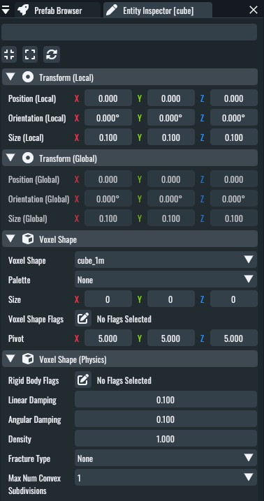
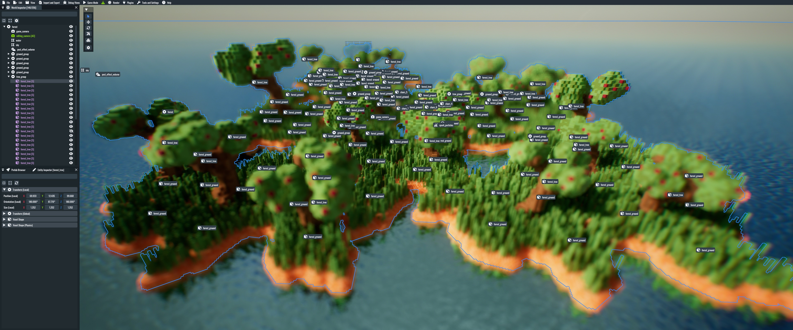
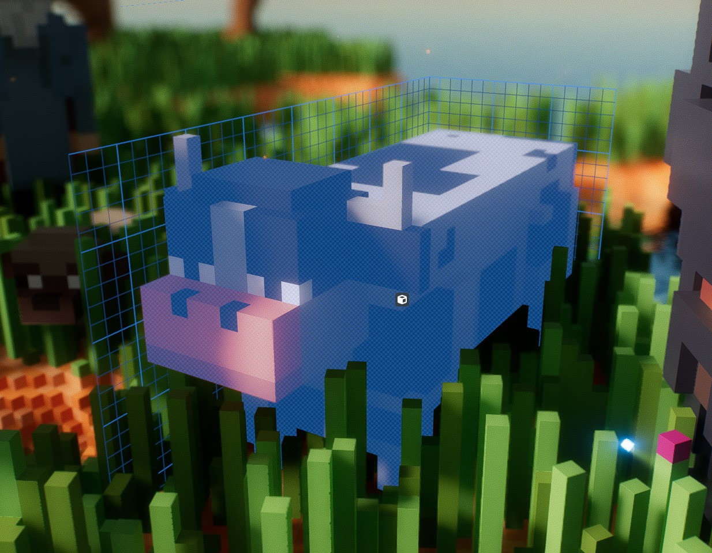

Introduction
============

IOLITE aims to make it easy to create fun and responsive voxel games. Let's start by going over the fundamentals first.

The overall game creation process
---------------------------------

Compared to other *game engines* or *game makers*, a single copy of IOLITE does *not* support working with different *projects*. Instead, IOLITE aims to be portable and thus directly sources all data from the directories next to the executable. A single copy of IOLITE *becomes your game*, it's as simple as that.

Shipping your game
------------------

When working with IOLITE, there is no differentiation between the *game* and *the editor*. There is no separate editor application; the editor itself is part of IOLITE's runtime. A big plus is that you implicitly ship the tools you used to create your game in the first place, allowing your community to utilize the same toolset for modding.

When launching IOLITE for the first time, the editor is automatically activated after the startup. Whether the application should launch into the editor or directly into the game mode (also referred to as the main game state) can be configured. Accordingly, all you have to do when shipping your game is to make the game mode the default, as depicted in the section :ref:`app_metadata`.

Entity Component System
-----------------------

The ECS (Entity Component System) is your primary tool for creating games with IOLITE. Entities are functionless objects that can be decorated with components to assign them one or multiple purposes. For example, an entity with a node component can be positioned in three-dimensional space. Adding a character controller component unlocks the ability to interact with the physics environment, and adding a voxel shape component creates a visual representation for your character.

IOLITE's ECS comes with a very flexible *property system*, which allows, on the one hand, storing data with your components, which can then be accessed programmatically, either via the scripting backend or the native API. On the other hand, it allows configuring your components in the editor. The following image shows the property editor for a selected entity in the editor, making it possible to inspect and modify properties of multiple components attached to a single entity:

The ECS in IOLITE utilizes data-oriented principles and stores all data in SOA layout (Structure of Arrays) while ensuring the data stays as compact as humanly possible in memory. This makes it possible to work with large data sets very efficiently.

.. note:: If you are aching for a more in-depth explanation of the topic, you can find more information on `Wikipedia <https://en.wikipedia.org/wiki/Entity_component_system>`_.
   
Worlds
------

Worlds are your creative containers that store a scene as a hierarchy of nodes. Nodes keep a one-to-many relationship with other nodes, meaning that a single node can have multiple children but only a single parent node. The following screenshot shows the small forest sample world, made up of instantiations of a few different voxel shapes:

   
The *world inspector* on the editor's left side shows the mentioned node hierarchy.

A world is defined by its name, a single root node, and the hierarchy of nodes attached to it. Worlds can be saved to and loaded from disk, and you can use them to structure your project:

Multiple worlds store the levels for your game, while another single world can house the scripts and logic for your menu screen. 

Voxel shapes
------------

Voxel shapes are the primary tool for building voxel worlds in IOLITE and are exposed in the editor via a component of the same name.

Voxel shapes form a three-dimensional grid where each cell stores a solid or *air* value. Voxels are stored as 8-bit values serving as indices into a color and material palette, allowing you to represent 255 different types plus empty (air) voxels.

- Shapes support storing up to 256³ voxels 
- Each voxel shape can reference a unique color and material palette
- Palette index 0 is reserved for marking empty (air) voxels
- Palette indices 1-255 map to slots 0-254 of the palette

Voxel shapes can either be created procedurally, authored in the editor via the :ref:`plugin_voxel_editing` plugin, or imported via the VOX file format generated by voxel editors like `Avoyd <https://www.avoyd.com/>`_ or `MagicaVoxel <https://ephtracy.github.io/>`_.

The following screenshot shows a single voxel shape which represents a cow character in the scene:

Data sources and the app metadata file
======================================

.. _repository: https://github.com/MissingDeadlines/iolite

Every project reads all its data from one or many so-called data sources. Data sources in the development environment are plain directories in the application's root directory, right next to the executable.

When deploying a build, you can opt in to package the data of each of the data sources to an IPKG (IOLITE Package) file. To create packages, you can use the package generator script, available in our `repository`_; see ``python_scripts/package_generator.py``.

The portable builds of IOLITE are shipped with two data sources. The mandatory ``base`` data source is provided as a package, while the ``default`` data source is available as directories and files, serving the simple default scene. You can use the directory structure of the ``default`` data source as a reference for creating new data sources.

.. important:: The ``base`` data source contains mandatory assets and has to be available. It's loaded by default, and there is no need to load it manually.

Using data sources for modding
------------------------------

Data sources provide an incredibly flexible approach to modding applications created with IOLITE.

Let's say you want to replace a specific voxel asset in a game, like a tree in a different color or a particular script where you've added some little tweaks or new features. All you have to do is to create a new data source directory and place the modified assets in the correct path in the directory structure, matching the file path used in the base data source. After that, you must load your data source before loading the data sources containing the original assets, which shadows the assets in the base data source.

The order in which data sources are loaded is defined via the app metadata file, depicted in detail in the following section.

.. _app_metadata:

Working with the app metadata file
----------------------------------

The app metadata data file is a JSON file with the following content:

.. code-block:: json

  {
      "application_name": "IOLITE",
      "organization_name": "Missing Deadlines",
      "version_string": "0.2.0",

      "data_sources": [
          "default"
      ],

      "initial_world": "default",
      "initial_game_state": "Editing",
  }

The app metadata allows you to adjust basic properties like your application's name and your organization. In addition, it is also in charge of defining the data sources that should be used to source files from. Data sources are loaded in the given order, and data provided by data sources listed first is prioritized.

Here's an overview of all the different parameters:

application_name
   The name of your application.
organization_name
   The name of your organization (if any).
version_string
   Version string following the `Semantic Versioning <https://semver.org/>`_ scheme.
data_sources
   The data sources used for your project. Data sources are loaded in the provided order. The engine starts searching for files in the first data sources and, if the file in question is found, skips searching all the other data sources.
initial_world
   The initial world to load after startup.
initial_game_state
   The initial game state to activate after startup. It can be either ``Editing`` for the editor or ``Main`` to start the application in game mode directly.

These additional settings are available in the PRO version of IOLITE:

show_splash_screen [PRO]
   Set to ``false`` to disable the splash screen shown during startup.
disable_pro_features [PRO]
   Set to ``false`` to disable all features of IOLITE PRO.